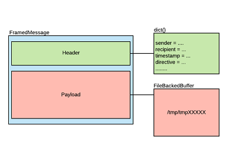
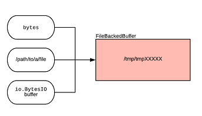
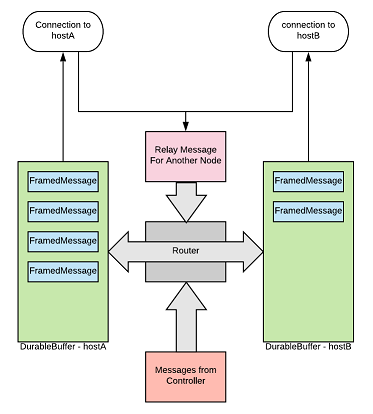
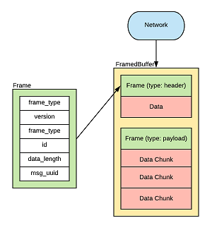

.. _messages:

Messages and Message Format
===========================

Headers and Payloads
--------------------

At the highest level, most messages (both Controller-sent directives and Plugin replies) are
composed of two parts: A header, and a payload.

Headers contain metadata about the message, such as the destination and sender. The payload is the
raw message containing the data that the node intended to send. Normally senders and consumers of
the Receptor mesh don't have to worry about the details of the transmission format of Messages but
Controller's need an understanding of some elements of the header and both Controllers and Plugins
need to understand how payloads are accepted and transmitted.

Headers on Response messages typically contain the following information

in_response_to
    The message id of the original request that started the work.

serial
    A number representing the numerical sequence of responses from a plugin.

timestamp
    utc timestamp representing when the reply was sent.

code
    If this value is 1, then a Receptor error occurred and the payload contains the details. A value
    of 0 represents a normal response that did not record a Receptor error.

eof
    If true, this response represents the last message sent, it is emitted once the plugin returns

Note that some messages will not have a payload and are represented only as headers. An EOF
message response from a plugin is one such message, other messages used internally by Receptor
also do not contain payloads.

Message Transmission Architecture
---------------------------------

Messages can be sent to the Receptor mesh either by calling the CLI command **receptor send** or
invoking :meth:`receptor.controller.Controller.send`. Internally Messages are represented as a
distinct data structure that encapsulates header information and the payload called a
:class:`receptor.messages.framed.FramedMessage`

.. rst-class::  clear-both

Message payloads aren't held in memory, depending on what kind of inputs are provided when sending
a payload, they are stored on disk until they are ready to be sent over the network and are
represented by an object called a :class:`receptor.messages.framed.FileBackedBuffer`

Once a Message is ingested it is sent to the :mod:`receptor.router`. Each Node that we are
connected to is allocated a buffer that outbound messages are put into while they wait their
turn to be sent, this is represented by a :class:`receptor.buffers.file.DurableBuffer`. It is also
likely that if we are relaying Messages from one node to another node that we'll shift the message
into another **DurableBuffer** as soon as we receive it.

When Messages are sent or received they are broken down into transmissable units involving a
:class:`receptor.messages.framed.Frame` describing the actual data element that will follow it.

The data element itself will be broken down into chunks in order to transmit smaller units.
As a Receptor node receives data from the network these Frames and bytes are pushed into a
:class:`receptor.messages.framed.FramedBuffer` where they are converted back into a
**FramedMessage**. These are what are delivered as Response messages and it's what the work
execution system itself uses to route work to plugins.

