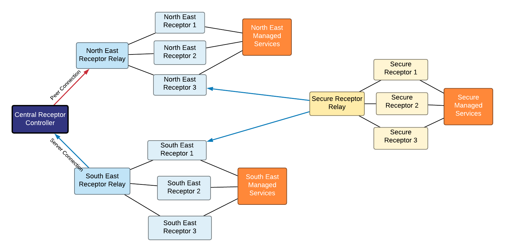
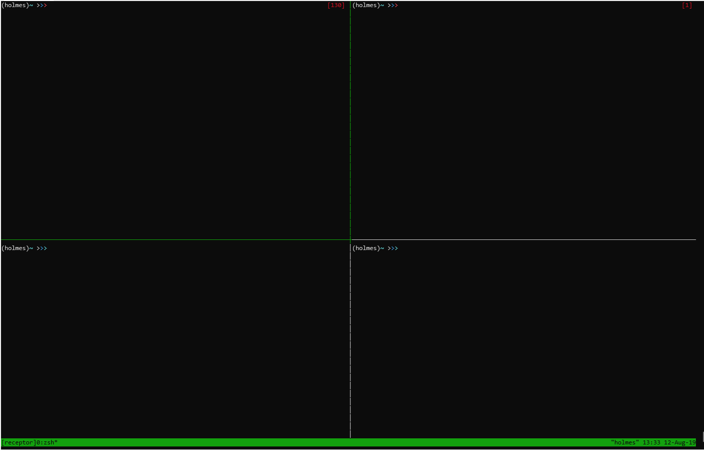
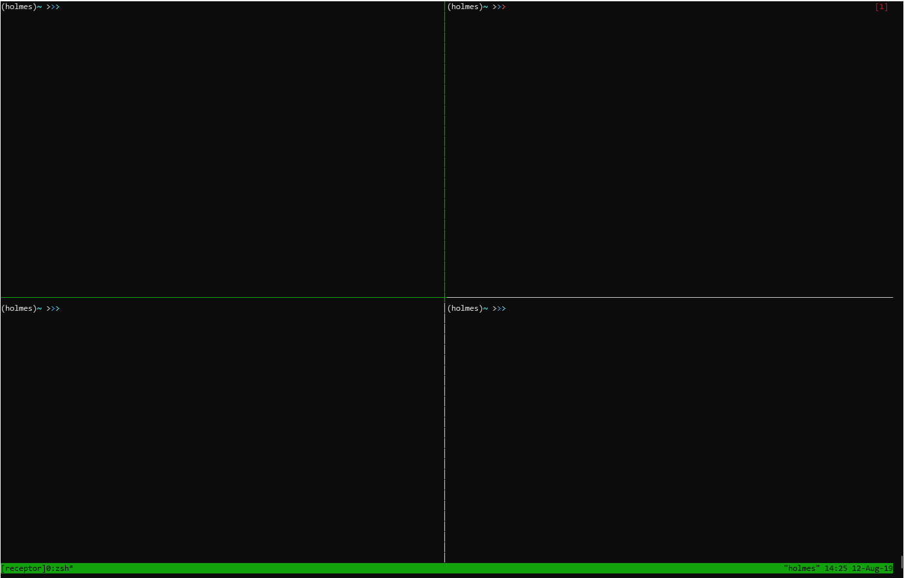

.. _intro:

Introduction to Receptor Concepts
=================================

Receptor is meant, primarily, to provide connectivity for services that need
to distribute work across different network topologies

Nodes connect to each other either by accepting connections from other nodes
or establishing connections to nodes themselves. Once these connections are
established they are treated exactly the same in that they are connection
points for the Receptor mesh network and messages pass over these transport
links to their ultimate destinations regardless of how the connection was
established.

If a connection is lost between two nodes and is considered **stale**, messages
that would normally be routed over that connection will be directed to a more
optimal route. If a more optimal route doesn't exist then messages will be
stored until connectivity is restored to that node, or a new route is created
elsewhere.

NodeID
------

Each **Receptor** node has a *node id* that is used to identify it. This is
separate from any other identifying characteristic (such as hostname or ip
address) since multiple nodes can run on the same host. If the node itself
isn't configured with one then one will be generated for it.

Controllers
-----------

A **Receptor** Controller exposes an interface on a port that allows other
services to communicate with the Receptor network in order to distribute work
and receive replies.

Routers
-------

**Receptor** Routers manage connections between nodes. Almost all Receptor
nodes are also routers that can participate in directing traffic to where
it needs to go. Even leaf nodes that only have a single connection will
broadcast their availability to perform work out to the larger mesh of
receptors.

Workers
---------

**Receptor** Worker nodes are nodes that have been configured to perform work.
These nodes have plugins installed alongside them that allow them to execute
tasks and respond with status and results. These plugins, when installed,
inform the Receptor network about the node's capabilities and any extra
metadata that may aid the Receptor network in routing work to them. This
information is automatically broadcast to the rest of the Receptor network.

Example of running a basic Receptor Network
-------------------------------------------

First lets install Receptor, you can do this from pip or a source checkout::

  $ pip install receptor

We're going to launch a very simple Receptor network that looks like this::

  controller <--> node-a <--> node-b

Then we're going to send a ping request from the ``controller`` to ``node-b``.

Now that we have **Receptor** installed we're going to start the 3 nodes in the
following configuration:

* ``controller``: Will listen on port 8888 and for controller requests on
  ``/tmp/receptor.sock``
* ``node-a``: Will listen on port 8889 and connect to ``controller`` on port
  8888
* ``node-b``: Will not start a listening server but will connect directly to
  ``node-a`` on port 8889

In the video below you'll see these 3 nodes launched in a ``tmux`` 4-pane layout
with the following commands::

  $ receptor --node-id=controller -d /tmp/controller controller --socket-path=/tmp/receptor.sock --listen-port=8888
  $ receptor --node-id=node-a -d /tmp/node-a node --listen-port=8889 --peer=localhost:8888
  $ receptor --node-id=node-b -d /tmp/node-b node --listen-port=8890 --peer=localhost:8889

In the last pane we execute the ``ping`` command::

  $ receptor ping --socket-path=/tmp/receptor.sock node-b

           
That's just a ping, though, what if we wanted to do some real work?
`Ansible Runner <https://github.com/ansible/ansible-runner>`_ adds support for
**Receptor** in `this pull request <https://github.com/ansible/ansible-runner/pull/308>`_

In the video below you'll see a very similar workflow but instead of running the
built-in ping command we'll call the Ansible ping module with::

  $ receptor send --socket-path=/tmp/receptor.sock --directive=runner:execute --recipient =node-b '{"module": "ping", "inventory": "localhost", "extravars": {"ansible_connection": "local"}, "host_pattern": "localhost"}'

